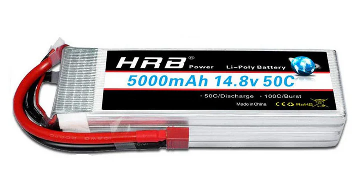
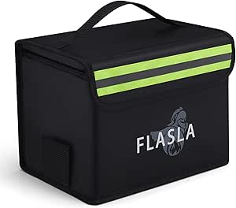
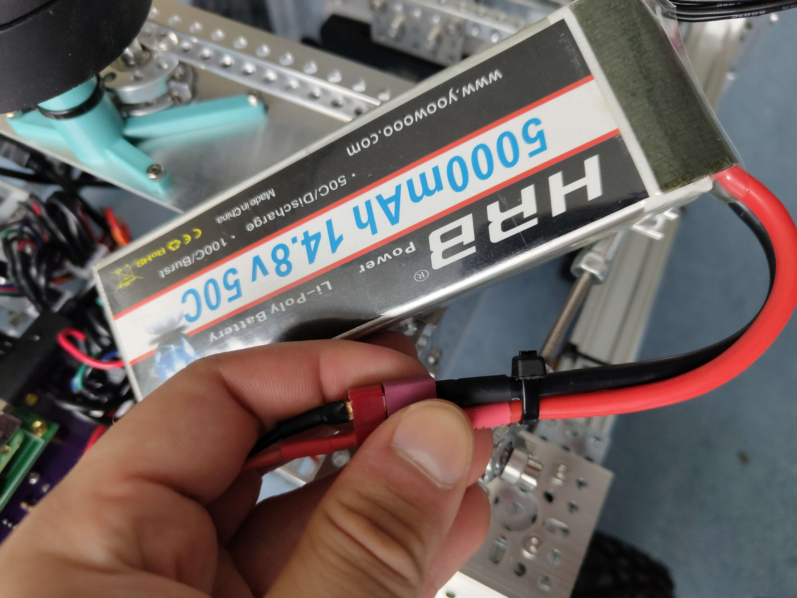
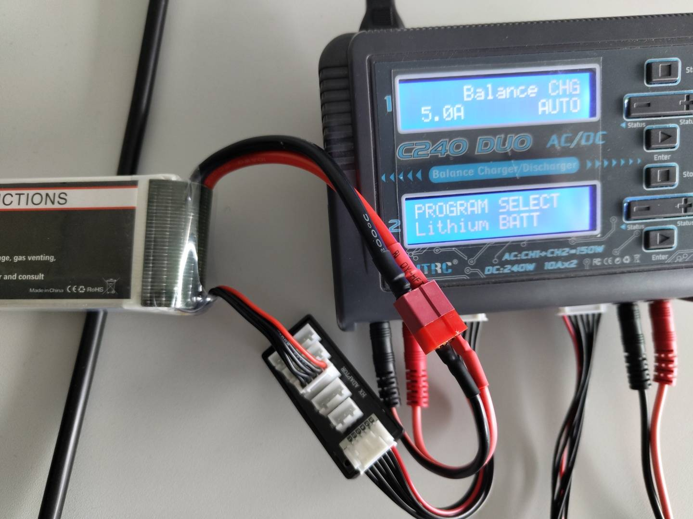

# Akkus

Als Akkus verwenden wir HRB LiPo Akkus mit 5000 mAh 14.8v 50C und Deans-T Stecker/T-Plug. 

Gelagert werden diese in einer Feuer- sowie Explosionssicheren Tasche in Schrank II. Der funktionierende Akku wurde mit einem Kabelbinder markiert.

## Technische Daten

Typ:                     Lithium-Polymer (Li-Po)

Spannung:                14,8 V (4S, 4 Zellen in Serie)

Kapazität:               5000 mAh

Entladestrom (C-Rating): 50C → bis zu 250 A kurzfristig

Steckertyp:              T-Plug

Anwendungszweck:         Versorgung der Motoren, Sensorik und Steuerungseinheiten

## Einsatzort

Der Akku wurde an der Rückseite des Rovers befestigt und ist dort mit dem Power-Board verbunden.

## Laden der Akkus

An der C240 Duo Ladestation können bis zu zwei Akkus geladen werden. Dabei ist zu beachten, dass die Einstellungen den Spezifikationen des Akkus entsprechen müssen. Das Ladegerät sollte im Balance-Modus sein und die Balance-Stecker sollten angeschlossen sein, wie hier:

## Probleme mit den Akkus

Die Akkus vom vergangenen Semester im Schrank gelagert waren, waren z.T. aufgebläht und entladen. Daher empfehlen wir die Akkus weiterhin in der dafür vorgesehenen Tasche zu lagern und bei Zeiten auf Spannung zu prüfen und ggf. erneut zu laden. Das Nachkaufen eines HRB LiPo Akkus mit 6000 mAh 14.8V 50C von Amazon hat sich als nicht empfehlenswert herausgestellt, da dieser bei Ankunft entladen war. Wir empfehlen daher eher den Kauf der Akkus von der Original-Webseite von HRB und das sofortige Prüfen der Spannung des Akkus nach dessen Ankunft, um ihn ggf. zu Laden/rechtzeitig zurückschicken zu können.

hrb-power.com
