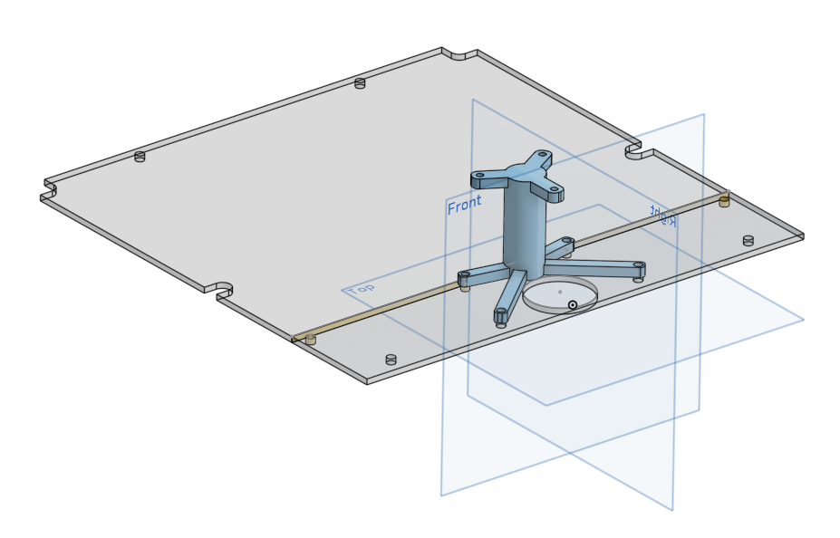

# Lidar Sensor

## Sensor
Der Sensor ist ein YDLIDAR G4 Lidar Sensor. Dieser ist oben auf dem Rover als hächster Punkt Montiert. Der Sensor ist per USB-C zu USB-A Kabel direkt im Raspberry Pi eingesteckt.

## Befestigung
Der Lidar Sensor ist auf einem 3D Gedrucktem Tower geschraubt. Dieser ist auf einer Alu Platte befestigt, welche einen Teil der Plexiglasplatte des Rovers ersetzt.

Die Alu Platte ist per hand nach diesem Plan gefertigt worden: [Plan](../../../../hardware/lidar/Top_Front_Back_Alu_3mm%20Drawing%201.pdf) 

Der Tower wird 3D gedruckt und dann auf die Alu Platte geklebt. Hier die Datei: [Stl-Datei](../../../../hardware/lidar/Lidar_Tower.stl)
