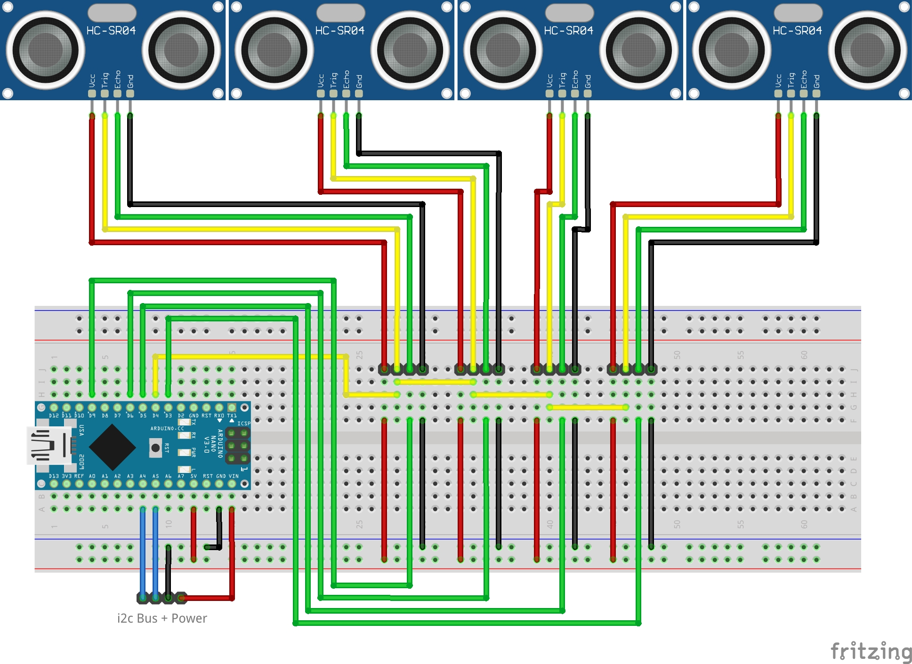
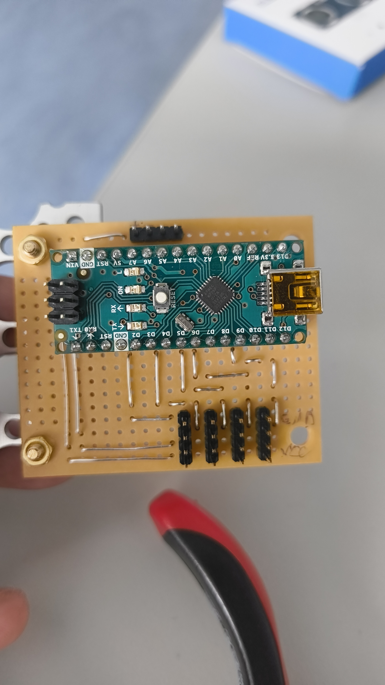
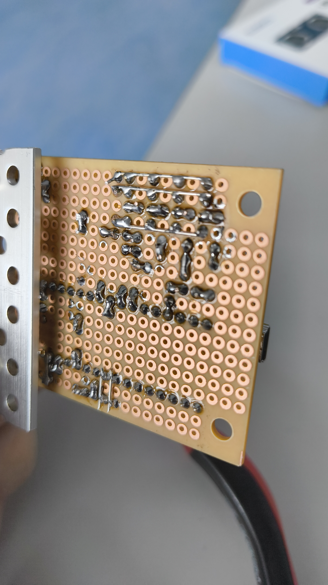

# Ultraschallsensoren

Die Ultraschallsensoren sind an den 4 Äußeren Rädern befestigt und sollen den Rover davor hindern in Hindernisse zu fahren.

## Sensoren
Sensor Modell ELEGOO HC-SR04, die an den Rädern befestigt sind.
Es gibt insgesamt 4 Sensoren, die jeweils an den beiden vorderen Rädern und den beiden hinteren Rädern befestigt sind.

## Auswertung
Die Ultraschallsensoren werden durch eine Platine mit einem Arduino Nano ausgewertet. Die Daten werden anschließend per i2c an den Raspberry Pi gesendet.

Die auswertung der Sensoren erfolgt nur nach einer i2c anfrage an den Arduinio Nano. Dieser misst dann die entsprechenden entfernungen und schickt die Ergebnisse an den Raspberry Pi.

### Software
Die Auswertung ist in einer .ino Datei geschrieben, welche auf dem Arduino Nano ausgeführt wird.

Der Arduino hat die i2c Adresse 0x40. Um Daten anzufragen muss an den Arduino eine i2c Anfrage gesendet werden.

! Diese Funktion ist noch nicht vom Raspberry Pi aus implementiert und muss noch ende zu ende getestet werden.

### Elektronik

Die Elektronik ist auf einem kleinen Breadboard verlötet, welches im hinteren Teil des Rovers befestigt ist.

Die Sensoren sind so verlötet, dass alle Sensoren gleichzeitig das Trigger Signal bekommen. Die Echo Pins sind einzeln an den Arduino Nano angeschlossen.

