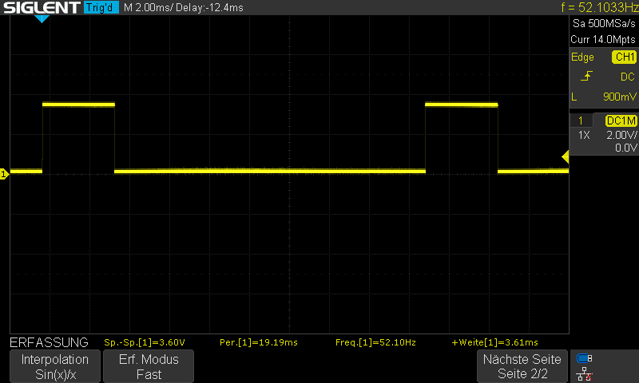

## Servo Bug

Date: 23.10.2025

Dieses Dokument erklärt, wie durch das`\src\osr-rover-code\scripts\calibrate_servos.py` Script der Winkel des Servos eingestellt wird.

Im [Datenblatt](https://www.gobilda.com/2000-series-dual-mode-servo-25-2-torque/#:~:text=Max%20PWM%20Range,500%2D2500%CE%BCsec) findet sich eine PWM-Range (Duty Cycle), welche die Position des Servos abbildet. Hierbei sind 0 bis actuation_range [1] auf die 500-2500μsec Pulsdauer aufgeteilt.

Der Sensor benötigt also eine Pulsdauer aus [500;2500] μsec, um korrekt angesteuert zu werden.
Leider ist das in diesem Script nicht der Fall. Folgendes Verhalten beim Ausführen des Scrips hat sich gezeigt:

Fall 1:
`(venv) rover@marsrover:~/osr_ws/src/osr-rover-code/scripts$ python calibrate_servos.py 0 0` ergibt eine Pulsdauer von 721,66μs anstatt wie erwartet 500μs

Fall 2:
`(venv) rover@marsrover:~/osr_ws/src/osr-rover-code/scripts$ python calibrate_servos.py 0 150` ergibt eine Pulsdauer von 2,16ms

Fall 3:
`(venv) rover@marsrover:~/osr_ws/src/osr-rover-code/scripts$ python calibrate_servos.py 0 300` ergibt eine Pulsdauer von 3,61ms anstatt wie erwartet 2500μs

Fall 4:
`(venv) rover@marsrover:~/osr_ws/src/osr-rover-code/scripts$ python calibrate_servos.py 0 185` ergibt eine Pulsdauer von genau 2,5ms.

Die Frage ist nun, was genau das Problem bei der generierung des PWM Signals ist.
Wir nehmen an, dass es sich um ein Softwareproblem irgendwo im ROS handelt, aber leider haben wir keine Erfahrung mit dem Debugging von ROS.

>[1] Zeile 32 in calibrate_servos.py :
>`kit.servo[args.motor_index].actuation_range = 300`